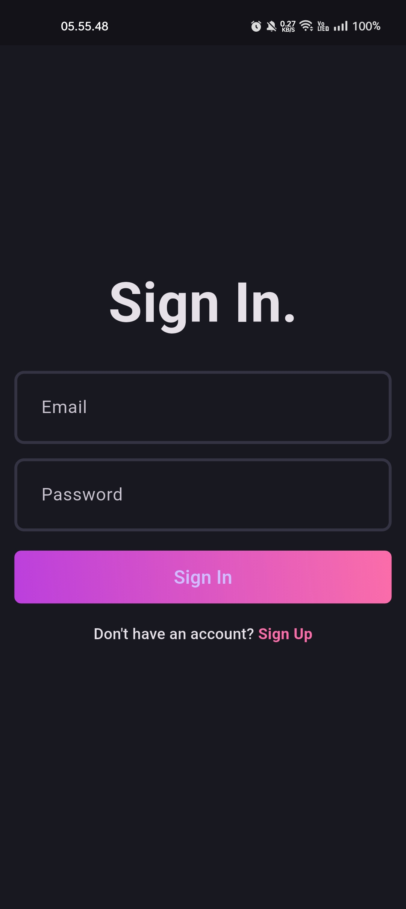
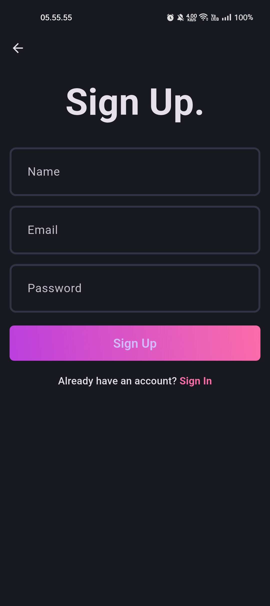
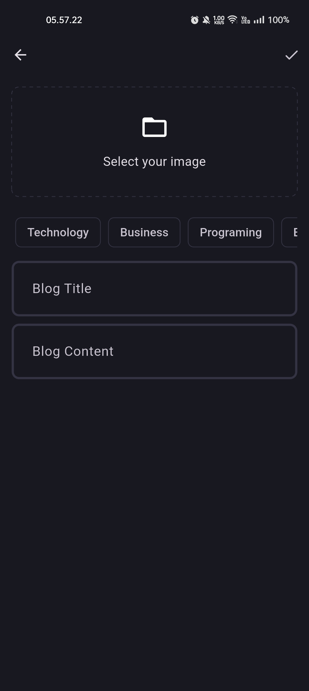
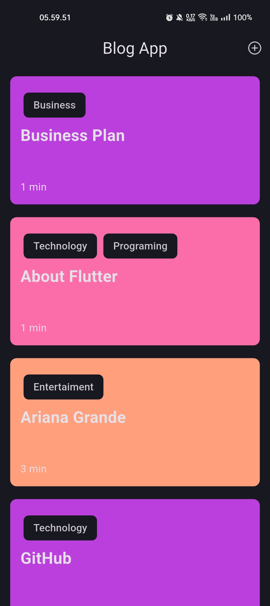
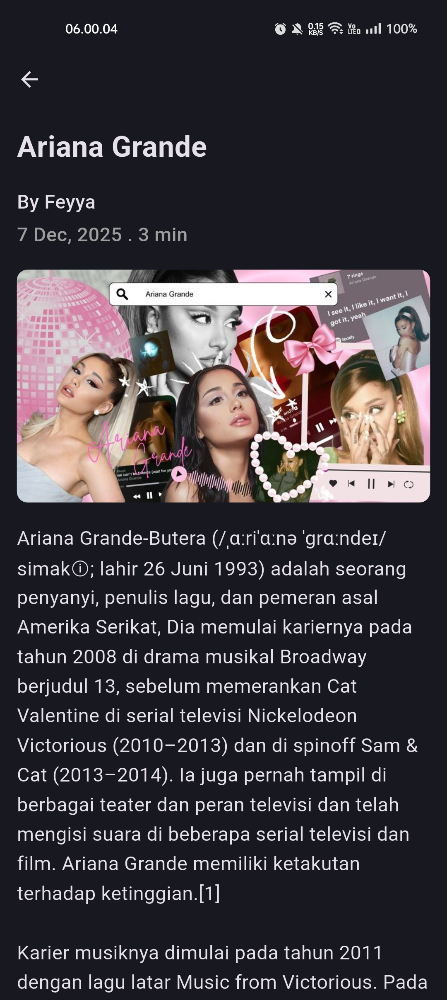

# 📘 Blog App — Clean Architecture

---

Aplikasi **Blog App** yang dibangun menggunakan **Flutter**, menerapkan **Clean Architecture**, serta menggunakan **Supabase** sebagai backend (auth, database, dan storage).

Project ini dibuat dengan mengikuti panduan dari channel YouTube :  
👉 [Link](https://www.youtube.com/watch?v=ELFORM9fmss)

---

## 🚀 Fitur Utama

### 🔐 Authentication
- **Sign Up (Registrasi)**
- **Sign In (Login)**

### 📝 Blog
- **Create New Blog** — membuat blog baru lengkap dengan judul, konten, dan gambar  
- **Detail Blog** — melihat detail konten blog
- **Upload Gambar** — setiap blog dapat menyertakan gambar yang diunggah ke **Supabase Storage**  
- **Cache Offline** — data blog dan gambar disimpan secara lokal agar tetap dapat dibaca saat perangkat offline

---

## 🛠️ Tech Stack

- **Flutter** — UI development  
- **Dart** — bahasa utama  
- **Clean Architecture** — scalable & maintainable structure  
- **Supabase** — backend services → https://supabase.com  

---

## 📦 Backend Setup (Supabase)

Aplikasi menggunakan **Supabase** dengan layanan:
- Supabase Auth  
- Supabase Database (PostgreSQL)  
- Supabase Storage  

Panduan lengkap Supabase → https://supabase.com/docs

---

## 🎯 Tujuan Project

Project ini dibuat untuk:
- Latihan membangun aplikasi Flutter dengan Clean Architecture  
- Menerapkan pemisahan layer (presentation, domain, data)  
- Memahami integrasi Flutter + Supabase  
- Membangun aplikasi blog full-stack sederhana  

---

## 📱 App Preview

  
  
  

  
  

